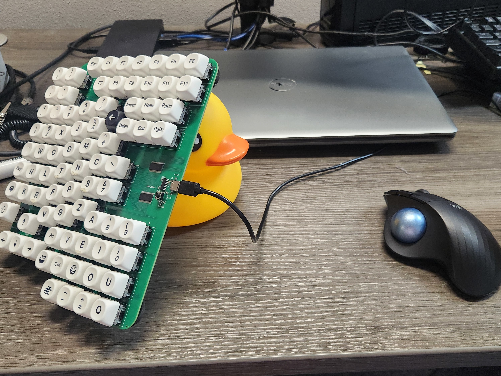

# Polymath-Studio One-Handed Keyboard

## Description

Type with only one hand

Designed around

1) the most common letters used
2) relationships between sounds
3) the shape of a left hand
4) practicality

The PS-OHK (pronounced "psawk" [p͡sɑk̚]) aims to be the ultimate one-handed typing experience all without special modifiers (a standard key count) and a layout that is relatively easy to get used to.

## Build and Upload

Dependencies:

- arduino-cli
- make
- sdcc
- ch55xtool
- libusb

Build with `make -C fw`

Hold program button down, plug in, let go of program button, and run `make -C fw upload` within 3 seconds

